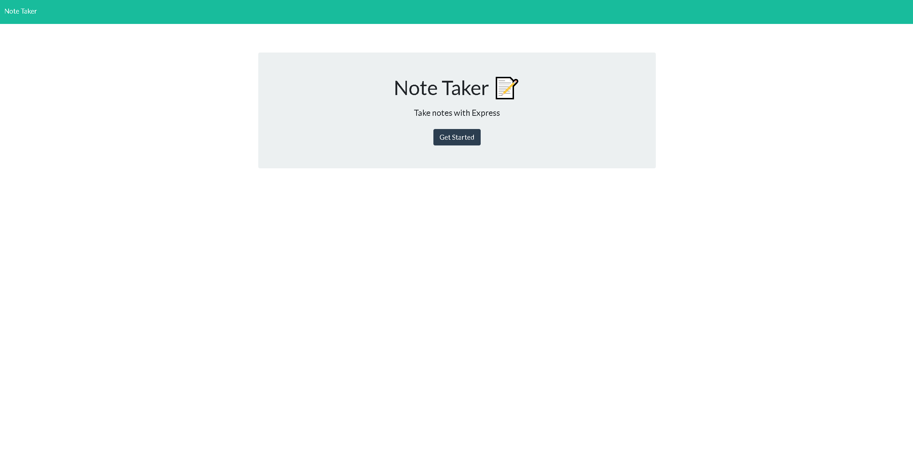
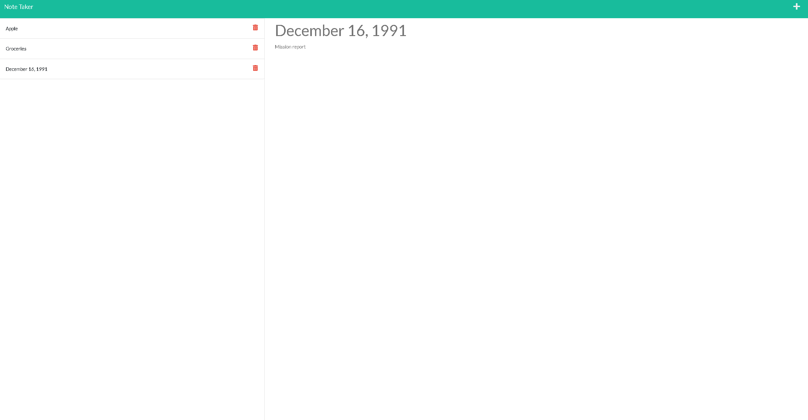

# Note Taker App

## Description 
This application was designed to allow a any user to write and save notes, so that they can organize their thoughts, notes, tasks or to-do's. The user has the ability to save their notes and come back to them later should they choose to do so at the users request. This application uses express.js on the back end which allow the application to make GET, POST and DELETE requests. 

## Table of Contents
* [Description](#description)
* [Technologies](#technologies)
* [Installation](#installation)
* [Usage](#usage)
* [Preview](#preview)
* [Webpage](#webpage)
* [Contributors](#contributors)
* [Contact](#contact)

## Technologies 
* JavaScript
* HTML
* CSS
* Node
* express.js

## Installation 
1. Copy repository from github 
2. Node.js must be installed
3. Install Express.js using the integrated terminal 
4. Install npm packages and other dependencies by inputting ` "npm i" ` in the terminal

## Usage
Once Node is installed type ` "node server.js" ` to run the server. You will be given a link (localhost:3001) that can be opened in the browser to display the application and begin using it. 

## Preview 

## Webpage
[Deployed Webpage](https://operation-wordsmith.herokuapp.com/)

## Contributors
To contribute to operation-wordsmith, clone this repo locally and commit your code in a separate branch

Contributors:

Made with [contrib.rocks](https://contrib.rocks).

## Contact
Eduardo Figueroa
* Github: https://github.com/eddiefigueroa18
* Email: eddiefigueroa18@gmail.com